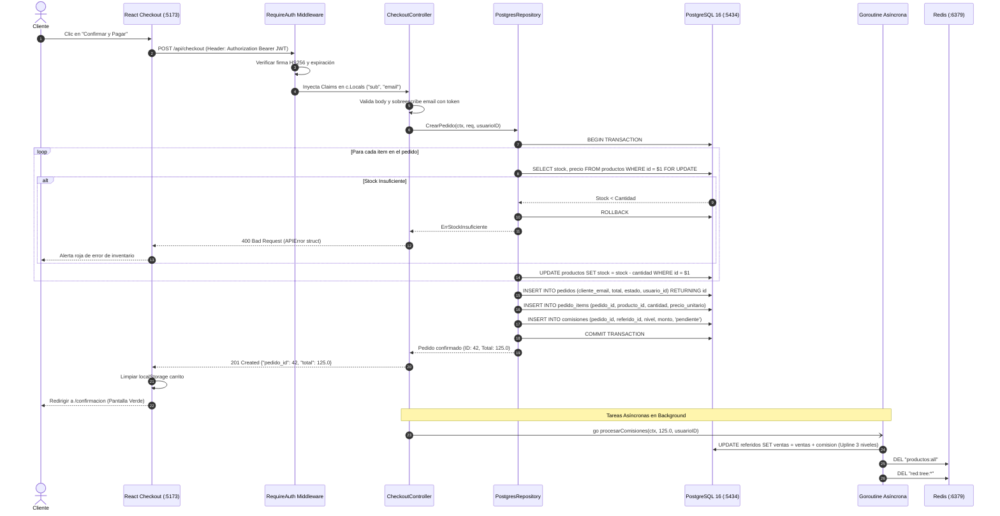

# SDD-07.1: FLUJOS Y SECUENCIAS — CHECKOUT ACID Y COMISIONES MLM

## 1. Diagrama de Secuencia Transaccional de Checkout

```mermaid
sequenceDiagram
    autonumber
    actor Cliente
    participant SPA as React Checkout (:5173)
    participant AuthMW as RequireAuth Middleware
    participant Controller as CheckoutController
    participant Repo as PostgresRepository
    participant PG as PostgreSQL 16 (:5434)
    participant Worker as Goroutine Asíncrona
    participant Redis as Redis (:6379)

    Cliente->>SPA: Clic en "Confirmar y Pagar"
    SPA->>AuthMW: POST /api/checkout (Header: Authorization Bearer JWT)
    AuthMW->>AuthMW: Verificar firma HS256 y expiración
    AuthMW->>Controller: Inyecta Claims en c.Locals ("sub", "email")
    Controller->>Controller: Valida body y sobreescribe email con token
    
    Controller->>Repo: CrearPedido(ctx, req, usuarioID)
    Repo->>PG: BEGIN TRANSACTION
    
    loop Para cada item en el pedido
        Repo->>PG: SELECT stock, precio FROM productos WHERE id = $1 FOR UPDATE
        alt Stock Insuficiente
            PG-->>Repo: Stock < Cantidad
            Repo->>PG: ROLLBACK
            Repo-->>Controller: ErrStockInsuficiente
            Controller-->>SPA: 400 Bad Request (APIError struct)
            SPA-->>Cliente: Alerta roja de error de inventario
        end
        Repo->>PG: UPDATE productos SET stock = stock - cantidad WHERE id = $1
    end

    Repo->>PG: INSERT INTO pedidos (cliente_email, total, estado, usuario_id) RETURNING id
    Repo->>PG: INSERT INTO pedido_items (pedido_id, producto_id, cantidad, precio_unitario)
    Repo->>PG: INSERT INTO comisiones (pedido_id, referido_id, nivel, monto, 'pendiente')
    Repo->>PG: COMMIT TRANSACTION
    
    Repo-->>Controller: Pedido confirmado (ID: 42, Total: 125.0)
    Controller-->>SPA: 201 Created {"pedido_id": 42, "total": 125.0}
    SPA->>SPA: Limpiar localStorage carrito
    SPA-->>Cliente: Redirigir a /confirmacion (Pantalla Verde)

    Note over Controller,Worker: Tareas Asíncronas en Background
    Controller-)Worker: go procesarComisiones(ctx, 125.0, usuarioID)
    Worker->>PG: UPDATE referidos SET ventas = ventas + comision (Upline 3 niveles)
    Worker->>Redis: DEL "productos:all"
    Worker->>Redis: DEL "red:tree:*"
```
